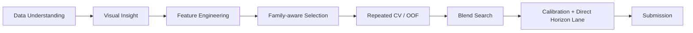

# WiDS Global Datathon 2026

Survival analysis for wildfire threat timing using only the first 5 hours of early incident signals.

This repo documents my notebook workflow for the WiDS Global Datathon 2026. The goal is to predict the probability that a wildfire will threaten an evacuation zone within **12, 24, 48, and 72 hours** while respecting censoring and keeping the output monotonic.

## Notebook Workflow

The notebook is intentionally structured as a clean, readable pipeline:

1. **Data Understanding**: schema, censoring, target horizons, and the train/test split.
2. **Visual Insight**: target timing, event vs. censored mix, and the strongest early signals.
3. **Feature Engineering**: distance dynamics, temporal quality, growth, alignment, and sparse feature shaping.
4. **Family-aware Selection**: permutation importance with caps per feature family so the model stays balanced.
5. **Repeated CV / OOF**: 5-fold repeated validation for more stable model comparison.
6. **Blend Search**: fine sweep of RSF + GBM blends, including horizon-specific blends.
7. **Calibration + Direct Horizon Lane**: Platt calibration as a candidate, plus a direct horizon logistic lane.
8. **Submission**: one final file whose name reflects the chosen method.

## What Matters Most

The strongest signals in this workflow are:

- distance to the evacuation zone
- closing speed and alignment
- observation density / temporal quality
- sparse growth and movement patterns

Those signals appear early and repeatedly across the notebook, which is why the pipeline stays focused on a small set of domain-aware transformations instead of feature explosion.

## Repo Contents

- [WiDS_Datathon_Notebooks.ipynb](WiDS_Datathon_Notebooks.ipynb): the full experiment notebook
- [README.md](README.md): project overview and workflow map
- `assets/readme-hero.svg`: the hero visual used at the top of this page

## Reproduce Locally

1. Open the notebook.
2. Run all cells from top to bottom.
3. Inspect the repeated CV / OOF report.
4. Generate the final submission file from the selected candidate.

## Notes

- Raw competition CSVs and generated submission files are ignored from version control by default.
- The notebook keeps the experiment flow readable so the analysis and the modeling story are easy to follow together.
