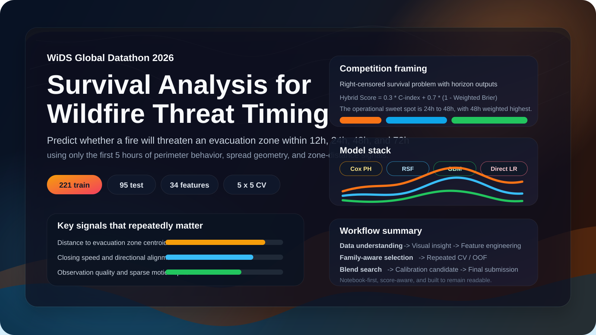
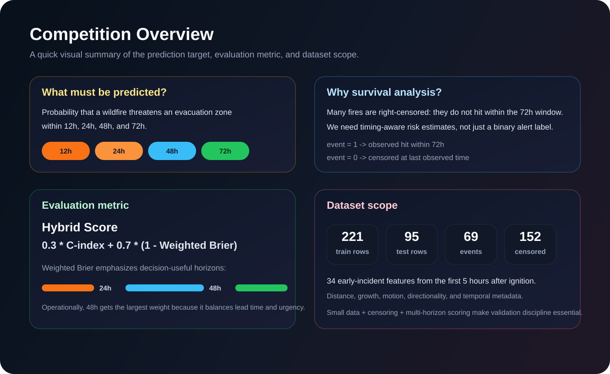
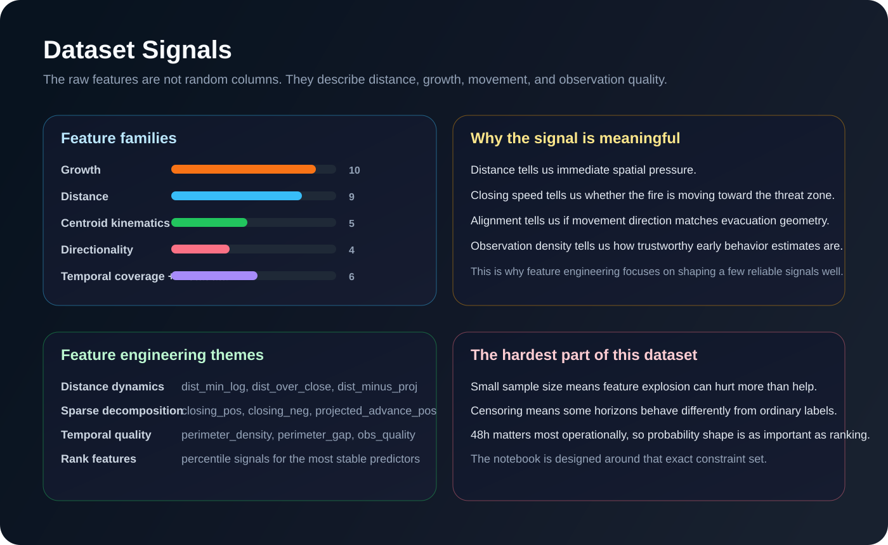
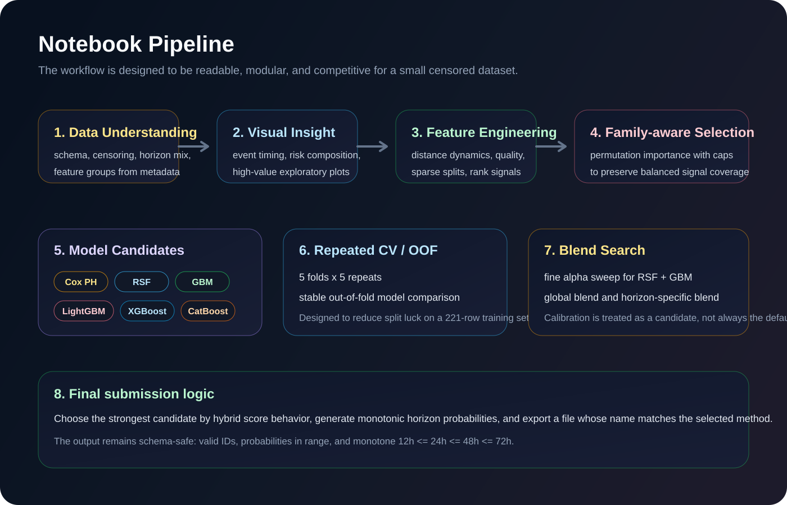

  

  
  
  
  
  
  
  
  

  
  

<h1 align="center">WiDS Global Datathon 2026</h1>

  Notebook-first survival modeling for wildfire threat timing using only the first 5 hours of early incident signals.

  This repository focuses on a practical emergency-response question:
  <strong>how likely is a wildfire to threaten an evacuation zone within the next 12, 24, 48, and 72 hours?</strong>

---

## Why This Project Matters

Most wildfire modeling examples stop at a binary question: "will this fire become dangerous?"  
This competition is more realistic and more difficult. Emergency teams need:

- a ranking of which fires are most urgent
- calibrated probabilities they can trust
- predictions across multiple time horizons, not just one label

That is why this project uses **survival analysis** instead of ordinary binary classification. We are modeling *when* a threat is likely to happen, while handling **right-censoring** correctly.

---

## Competition Overview

  

**Competition:** WiDS Global Datathon 2026  
**Theme:** Predicting time-to-threat for evacuation zones using survival analysis  
**Hosted on Kaggle:** [WiDS Global Datathon 2026](https://www.kaggle.com/competitions/WiDSWorldWide_GlobalDathon26)

### The core prediction task

Given only the **first 5 hours** after a wildfire is first observed, predict the probability that the fire will come within **5 km of any evacuation zone centroid** by:

- `12h`
- `24h`
- `48h`
- `72h`

### Why survival analysis is the right fit

This is a **right-censored** problem:

- `event = 1` means the fire hit the threat threshold within the 72-hour window.
- `event = 0` means the fire did not hit within the observation window, so we only know that the true hit time is beyond the last observed time.

That matters because many training cases are *not fully observed*. A standard classifier would throw away timing structure that the competition explicitly cares about.

### Evaluation metric

The competition uses a hybrid metric:

`Hybrid Score = 0.3 * C-index + 0.7 * (1 - Weighted Brier Score)`

The weighted Brier component emphasizes:

- `24h`
- `48h`
- `72h`

with **48h** carrying the highest operational weight.

That is why this notebook does not just optimize ranking. It also pays close attention to **probability calibration** and **monotonic horizon outputs**.

---

## Dataset At A Glance

  

The competition dataset is small, structured, and information-dense:

| Split | Rows | Notes |
| --- | ---: | --- |
| Train | 221 | Includes targets and censoring information |
| Test | 95 | Submission set without targets |
| Events | 69 | Fires that threatened an evacuation zone within 72 hours |
| Censored | 152 | Fires that did not hit within the observed window |
| Features | 34 | Early-fire geometry, motion, distance, and temporal metadata |

### What the files mean

| File | Role |
| --- | --- |
| `train.csv` | Main training set with `time_to_hit_hours` and `event` |
| `test.csv` | Competition inference set |
| `metaData.csv` | Data dictionary and feature definitions |
| `sample_submission.csv` | Required schema for final predictions |

### Feature families in the raw data

| Family | Count | What it describes |
| --- | ---: | --- |
| Growth | 10 | Area expansion, growth rates, radial change |
| Distance | 9 | Minimum distance, slope, acceleration, closing speed |
| Centroid kinematics | 5 | Fire centroid displacement and motion |
| Directionality | 4 | Alignment toward evacuation zones |
| Temporal coverage | 3 | How dense and reliable the first-5-hour observations are |
| Temporal metadata | 3 | Hour, weekday, and month of incident start |

### What makes this dataset tricky

- It is **small**, so overfitting happens easily.
- It is **censored**, so naive classification can be misleading.
- It is **horizon-based**, so 24h, 48h, and 72h should not be treated exactly the same.
- It contains **strong domain structure**, especially around distance, closing speed, and observation quality.

> Raw competition CSV files are intentionally ignored in version control.  
> Download them from Kaggle and place them in the repository root if you want to rerun the notebook locally.

---

## Methodology

  

This project uses a notebook-first workflow that stays readable while still being competitive for a small survival-analysis dataset.

### 1. Data Understanding

The notebook starts by making the problem legible:

- target distribution and censoring mix
- horizon coverage
- feature schema from `metaData.csv`
- the parts of the data that are likely to matter most for operational risk

### 2. Visual Insight

Before modeling, the notebook surfaces the most meaningful early signals:

- distance to the nearest evacuation zone centroid
- closing speed toward that zone
- directional alignment of spread
- observation density and temporal quality

This keeps the rest of the modeling grounded in domain behavior instead of treating the table like anonymous columns.

### 3. Feature Engineering

The engineered features are designed to be **useful**, not just numerous.

Core ideas include:

- **cyclical time encoding**
  - `hour_sin`, `hour_cos`, `dow_sin`, `dow_cos`, `month_sin`, `month_cos`
- **distance dynamics**
  - `dist_min_log`, `dist_over_close`, `dist_minus_proj`
- **sparse decomposition**
  - split direction-sensitive fields into positive and negative components
- **movement-pressure interactions**
  - `closing_alignment`, `dist_change_closing`, `projected_advance_pos`
- **observation quality**
  - `perimeter_density`, `perimeter_gap`, `obs_quality`
- **rank-style signals**
  - percentile-rank features for the variables that matter most consistently

This is especially important in small survival datasets, where a few well-shaped features usually beat large, noisy expansions.

### 4. Family-Aware Feature Selection

Instead of keeping or dropping features purely by global rank, the notebook uses **permutation importance with family caps**.

Why this matters:

- distance features can dominate the ranking
- temporal-quality features still matter even if their raw importance is slightly lower
- pure top-k selection can accidentally erase entire feature families

The family-aware approach keeps the final design compact while preserving modeling balance.

### 5. Model Candidates

The notebook evaluates multiple lanes:

- `CoxPH` for a strong linear survival baseline
- `Random Survival Forest` for non-linear survival structure
- `Gradient Boosting Survival Analysis` for boosted survival curves
- `LightGBM`, `XGBoost`, and `CatBoost` as additional event-risk candidates
- `Direct Horizon Logistic Regression` as a horizon-specific lane

In practice, the most promising core pair has been:

- `RSF`
- `GBM`

Those two models repeatedly provide the best trade-off between ranking and calibration.

### 6. Validation Strategy

This notebook does not rely on a single lucky split. It uses:

- `5-fold repeated CV`
- `5 repeats`
- stratification that respects outcome structure
- out-of-fold aggregation for fair candidate comparison

That repeated OOF setup makes the model comparisons much more stable than a single validation split, which is critical when the training set has only `221` rows.

### 7. Blend Search and Calibration

The final modeling lane is deliberately pragmatic:

- fine alpha sweep for `RSF + GBM`
- global raw blends
- horizon-specific blends
- Platt calibration as a **candidate**, not an automatic default
- direct horizon lane for `12h / 24h / 48h`, with `72h` handled as a tail anchor

This is important because calibration can improve local OOF metrics while still hurting public leaderboard performance if it becomes too flexible for such a small dataset.

### 8. Final Submission Logic

The final submission is constrained to stay competition-safe:

- correct Kaggle schema
- valid probabilities in `[0, 1]`
- row-wise monotonicity: `prob_12h <= prob_24h <= prob_48h <= prob_72h`
- file naming that reflects the chosen method

---

## What The Notebook Actually Does

The current notebook is organized into eight readable sections:

1. `Data Understanding`
2. `Visualisasi Insight Inti`
3. `Feature Engineering`
4. `Feature Selection via Family-aware Permutation Importance`
5. `Utility Functions & Model Definitions`
6. `Repeated CV Evaluation`
7. `Blend Search, Calibration Candidate, Direct Horizon Lane, and Final Submission`
8. `Ringkasan`

That structure is intentional. The goal is not just to produce a score, but to make the reasoning path understandable for someone learning survival analysis in a real competition setting.

---

## Repository Structure

| Path | Description |
| --- | --- |
| [WiDS_Datathon_Notebooks.ipynb](WiDS_Datathon_Notebooks.ipynb) | Main end-to-end notebook |
| [README.md](README.md) | Public project overview |
| `assets/readme-hero.svg` | Hero banner for the repository |
| `assets/readme-overview.svg` | Competition and evaluation visual |
| `assets/readme-signals.svg` | Dataset and signal summary visual |
| `assets/readme-pipeline.svg` | Modeling workflow visual |

---

## How To Run

### Environment

The notebook currently uses:

- `Python`
- `Jupyter`
- `pandas`
- `numpy`
- `matplotlib`
- `seaborn`
- `scikit-learn`
- `scikit-survival`
- `lightgbm`
- `xgboost`
- `catboost`
- `optuna`

### Reproduction steps

1. Download the competition files from Kaggle.
2. Place `train.csv`, `test.csv`, `metaData.csv`, and `sample_submission.csv` in the repo root.
3. Open [WiDS_Datathon_Notebooks.ipynb](WiDS_Datathon_Notebooks.ipynb).
4. Run the notebook from top to bottom.
5. Inspect the validation and blend comparison tables.
6. Generate the final submission file selected by the notebook.

---

## Current Takeaways

The most valuable lessons from this project so far:

- survival analysis is a better framing than ordinary classification for this task
- feature engineering matters a lot more than model count in a small censored dataset
- `RSF + GBM` is a strong practical core
- calibration helps only when it is restrained and properly validated
- public leaderboard gains often come from **better probability shaping**, not just more models

---

## Kaggle Link

If you want to inspect the official challenge page directly, use this link:

**Kaggle competition:** [https://www.kaggle.com/competitions/WiDSWorldWide_GlobalDathon26](https://www.kaggle.com/competitions/WiDSWorldWide_GlobalDathon26)

---

## Closing Note

This repository is not just a submission dump. It is a learning-oriented, competition-focused notebook workflow that tries to balance:

- interpretability
- strong validation discipline
- practical feature engineering
- realistic survival-analysis thinking for a high-stakes wildfire problem

If you open the notebook, you should be able to follow the modeling story from raw data understanding all the way to final submission generation.

---

## Author

**Sahrul Adicandra Effendy**  
Data Science Student at Airlangga University
